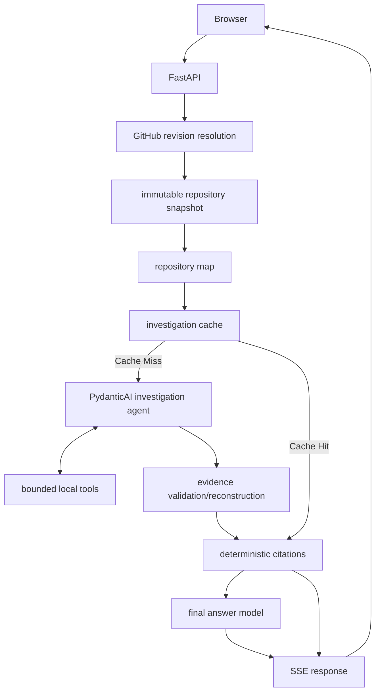

# Trace: Evidence-Grounded AI Repository Investigator

## Project Introduction

Trace is an evidence-grounded AI repository investigation tool that accepts a public GitHub repository and an engineering question, resolves the repository to an immutable commit, investigates the codebase using bounded local tools, validates observed evidence, and produces a streamed answer with deterministic source citations and a public-safe investigation trace.

## Key Differentiators

- **Immutable commit-pinned repository snapshots**: Resolves targets to an exact Git SHA to ensure reproducible investigations.
- **Local repository investigation**: Works on a local filesystem snapshot instead of making repeated, slow GitHub API calls.
- **PydanticAI tool-based investigation**: Driven by a state-of-the-art agent orchestration framework using PydanticAI.
- **Bounded read_file, search_code, and list_directory**: Safe, highly constrained tools that prevent runaway token consumption.
- **EvidenceSpan / EvidenceExcerpt grounding validation**: Enforces that the model only cites exact lines it verifiably observed.
- **Concrete implementation traversal/validation**: Validates that agents reach actual implementations instead of hallucinating based on interfaces.
- **Deterministic source citations**: Generates immutable GitHub commit URLs for verified evidence.
- **Public-safe investigation traces**: Streams sanitized paths without leaking chain-of-thought, API keys, or raw prompts.
- **Exact filesystem snapshot/investigation caching**: Skips redundant work with deterministic caching.
- **SSE streaming**: Byte-by-byte streaming for a responsive UI.
- **Phase H security protections**: Hardened with rate limits, concurrency controls, and strict CSPs.

## Architecture



*Note: For the complete technical design, see [ARCHITECTURE.md](ARCHITECTURE.md).*

## Tech Stack

- **Backend Framework**: FastAPI, Uvicorn
- **AI Agent Orchestration**: PydanticAI, Google GenAI SDK (`google-genai`)
- **HTTP Client**: HTTPX, Requests
- **Environment Management**: python-dotenv
- **Testing**: Pytest
- **Frontend**: Vanilla HTML/JS/CSS with marked.js and DOMPurify for safe rendering.

## Local Development

### Prerequisites

- Python 3.10+
- `ripgrep` installed on your system (e.g. `brew install ripgrep` or `apt-get install ripgrep`)

### Setup

1. Create a virtual environment and install dependencies:
```bash
python3 -m venv .venv
source .venv/bin/activate
pip install -r requirements.txt
```

2. Configuration:
Create a `.env` file in the root directory:
```env
# Required
GEMINI_API_KEY=your_gemini_api_key_here

# Optional: GitHub token to increase API rate limits during resolution
GITHUB_TOKEN=your_github_token_here

# Optional Trace settings
TRACE_LLM_MODEL=gemini-3.1-flash-lite
```

3. Run the application:
```bash
uvicorn app.main:app --reload
```

4. Access the frontend:
Open your browser and navigate to `http://localhost:8000/`.

## Docker

To run Trace using Docker:

1. Build the image:
```bash
docker build -t trace .
```

2. Run the container:
```bash
docker run -p 8000:8000 -e GEMINI_API_KEY="your_api_key" trace
```

## Deployment

Trace can be deployed easily on platforms like Render or Railway for portfolio demonstration purposes.

- **Required environment variables**: Provide `GEMINI_API_KEY` (and `GITHUB_TOKEN` if desired) in your platform's environment variables.
- **Cache persistence**: Cache is local filesystem-based and is considered best-effort. It will clear on container restarts, which is safe and expected.
- **Limits**: Rate limiting and concurrency controls (`MAX_CONCURRENT_INVESTIGATIONS`, `RATE_LIMIT_PER_MIN`) are per-process/local.
- **Warning**: Trace is intended as a portfolio/demo application and should not be presented as horizontally scalable production SaaS without additional infrastructure (e.g. Redis/Postgres) to externalize state.

## Security / Demo Hardening

Trace is hardened for public portfolio usage:
- **Sanitized Markdown rendering**: Safe rendering using DOMPurify.
- **Input validation**: Strict validation of URLs and repository targets.
- **Rate limiting**: IP-based rate limiting to prevent abuse.
- **Concurrency limiting**: Global semaphore to prevent system exhaustion.
- **Security headers/CSP**: Strict Content-Security-Policy to block XSS and malicious inline scripts.
- **Safe archive extraction**: Path validation when materializing repositories.
- **Immutable revision pinning**: Protection against mutating underlying code.

## Testing

Offline verification tests do not require live Gemini or GitHub evaluation calls. Run them via:
```bash
python3 -m compileall app tests evals
npx basedpyright app tests evals
.venv/bin/pytest tests/
```

## Evaluation

Trace includes a deterministic evaluation harness to measure accuracy and grounding:
- **Evidence completeness**: Ensures all required structural files are read.
- **Concrete implementation grounding**: Verifies the agent read actual concrete implementations, not just interfaces.
- **Citation ID validity & usage**: Checks that all citations match actual emitted IDs.
- **Citation coverage**: Measures the proportion of observed evidence actually cited.
- **Execution metrics**: Validates termination reasons and action efficiency.

*(Live evaluations against the Gemini API require explicit confirmation to run).*

## Current Limitations

- Investigation action count is model/path dependent and may exhaust the production 8-action budget on some cold-cache investigations.
- PydanticAI investigation history is replayed normally and can increase token usage on deeper investigations.
- Citation provenance is strongly validated, but Trace does not perform claim-level factual entailment verification.
- Rate limiting/concurrency controls are local to one process.
- Cache is best-effort local filesystem state.
- Intended as a portfolio/demo application rather than unrestricted production SaaS.

## Demo

> **Note:** A final screenshot/GIF will be added after the post-Phase-I local smoke test.